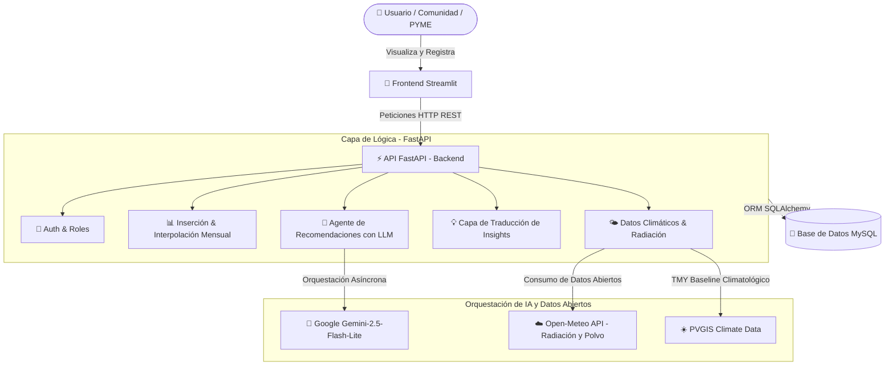
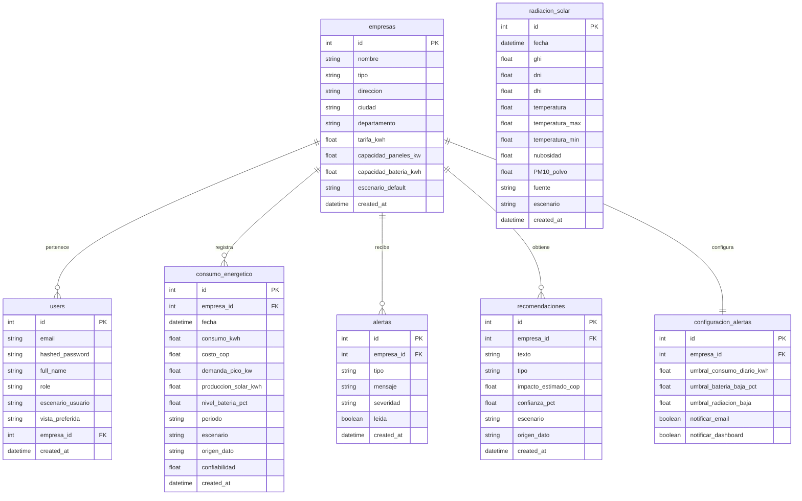

# ☀️ Agente Solar Riohacha

> **Copiloto con Inteligencia Artificial y Datos Abiertos para la Democratización de la Energía Limpia y Resiliencia ante Apagones en La Guajira**

Desarrollado bajo la rúbrica y criterios de evaluación de la **Hackathon Regional La Guajira (MinTIC · Colombia 5.0)**, **Agente Solar Riohacha** es una plataforma de software relacional, dockerizada e interactiva, diseñada para solventar la paradoja energética del norte de Colombia mediante analítica avanzada de radiación, orquestación autónoma de almacenamiento y una capa dual de recomendaciones por Inteligencia Artificial (Gemini + Heurística).

---

## 🎯 1. La Paradoja Energética de La Guajira (El Problema)

Riohacha y la región de La Guajira son, por naturaleza, la **capital de la energía solar de Colombia**, gozando de una radiación diaria excepcional de hasta **7.0 kWh/m²/día** (casi el doble del promedio de países líderes en transición energética). 

Sin embargo, sus habitantes y comercios sufren una cruda paradoja energética:
* **Asfixia Tarifaria:** Tarifas eléctricas que rondan los **$943 COP/kWh** (impuestas por Air-E), representando hasta el **33% del OpEx (gasto operativo)** de las micro y pequeñas empresas (PYMEs) locales.
* **Inestabilidad Crítica de Red:** Promedios de **más de 60 horas anuales de cortes y apagones** (blackouts), generando pérdidas económicas de más de $18,700 millones de pesos al año en la región.
* **Carencia de Herramientas:** Falta de plataformas para calcular con honestidad y realismo el Retorno de Inversión (ROI) de sistemas fotovoltaicos y optimizar el almacenamiento de energía de forma autónoma.

---

## ⚡ 2. La Solución Propuesta: Agente Solar Riohacha

**Agente Solar** actúa como un copiloto energético inteligente y dinámico. Mediante la integración automática de datos climáticos abiertos en tiempo real y el uso de modelos de lenguaje avanzados (**Gemini 2.5 Flash Lite**), el sistema traduce métricas de ingeniería complejas en decisiones financieras y hábitos operativos sencillos para cualquier ciudadano.

### 🌟 Los 4 Pilares de Valor de la Plataforma
1. **Mitigación Directa de Tarifas:** Proyecciones y simulaciones financieras 100% transparentes e ingresadas a partir del recibo real de Air-E del usuario en Riohacha, eliminando estimaciones ficticias de estratos.
2. **Resiliencia ante Apagones:** Predicción inteligente de riesgos de corte eléctrico basándose en análisis histórico y condiciones de la red regional.
3. **Orquestación Autónoma de Baterías:** Algoritmo dinámico que gobierna de forma autónoma el almacenamiento local de energía y el enrutamiento de excedentes solares diurnos para prevenir apagones nocturnos.
4. **Empoderamiento Comunitario (Educación):** Bifurcación adaptativa del sistema que ajusta el vocabulario, las métricas y los consejos según el perfil de usuario.

---

## 🏠 3. Bifurcación Adaptativa: Perfiles de Usuario

El sistema se adapta de manera nativa a quien inicia sesión, eliminando la sobrecarga cognitiva y adecuando la experiencia para cumplir con los requerimientos de adaptabilidad local del reto:

### A. Vista Residencial / Comunidad (Hogar)
* **Enfoque:** Lenguaje cálido, familiar, optimista y libre de tecnicismos complejos de ingeniería.
* **Métricas Principales:** Semáforos de estado sencillos (Verde/Amarillo/Rojo), recordatorios prácticos de recibo mensual y ahorro acumulado del presupuesto del hogar.
* **Simulador Residencial:** Simula un sistema básico recomendado de **2.5 kWp** para techos residenciales, mostrando cómo cubriría el refrigerador, la nevera y el aire acondicionado familiar.
* **Recomendaciones IA:** Gemini y el motor heurístico adaptan sus consejos estrictamente a hábitos de casa (lavar en horas de sol, apagar luces, programar aire de la habitación).

### B. Vista Comercial / PYME (Empresa)
* **Enfoque:** Analítico, corporativo y financiero.
* **Métricas Principales:** Telemetría detallada del inversor, OpEx proyectado, retorno de inversión (ROI) a 5-10 años y picos de demanda máxima ($kW$) cobrados en facturación industrial.
* **Dimensionamiento Comercial:** Analiza sistemas de **10.0 kWp** en adelante con bancos de baterías comerciales, calculando la amortización fiscal y depreciación de activos.

---

## 🏗️ 4. Arquitectura General del Sistema

La solución está desarrollada bajo una arquitectura robusta, modular y contenerizada en **Docker**, asegurando un despliegue y reproducción inmediata en menos de 5 minutos:



---

## 💾 5. Esquema Relacional de Base de Datos

Utilizamos **MySQL 8.0** con persistencia relacional completa. El diseño de las tablas optimiza el almacenamiento diario y la configuración personalizada de los perfiles:



---

## ⚡ 6. Flujo de Trabajo e Integraciones Inteligentes

### A. Inicialización y Sincronización en Startup (Segundo Plano)
Para garantizar que cualquier usuario registrado tenga datos reales de Riohacha desde el segundo uno, implementamos un servicio de **Precalentamiento de Datos Climáticos en Startup** (`app/services/startup_sync.py`). 
Al levantar el contenedor del backend, el sistema de forma no bloqueante (`asyncio.create_task` dentro del `lifespan` de FastAPI):
1. Descarga e inserta los últimos 30 días de radiación real de **Open-Meteo Archive (ERA5)**.
2. Descarga y almacena datos históricos de respaldo de la **NASA POWER API**.
3. Consulta la baseline climatológica típica de **PVGIS (Año Meteorológico Típico - TMY)**.
4. Precalienta las condiciones del aire e índice de contaminación de **OpenWeather**.

### B. Algoritmo del Orquestador Autónomo ante Apagones
El sistema vincula de forma activa las predicciones de apagón con la configuración técnica del sistema fotovoltaico de la empresa o casa:
* 🔴 **Riesgo Crítico (>= 40%):** Dispara el modo **Carga Máxima Preventiva**. Bloquea el ciclado de baterías (cero descarga para ahorro de OpEx) y direcciona el 100% de excedentes solares diurnos a cargar las baterías al 100% de su capacidad. Garantiza máxima autonomía de horas de respaldo para la noche.
* 🟡 **Riesgo Medio (20% - 39%):** Dispara el modo **Respaldo Proactivo**. Eleva el umbral mínimo de seguridad de almacenamiento al 60% (colchón protector), permitiendo usar el 40% superior para aplanar la demanda en horas de alta facturación de Air-E.
* 🟢 **Riesgo Bajo (< 20%):** Dispara el modo **Optimización OpEx**. Opera con máxima eficiencia económica, permitiendo ciclar libremente las baterías durante el día para aplanar picos nocturnos domésticos o de PYMEs y recortar al mínimo la facturación de la red eléctrica.

### C. Alerta de Polvo del Desierto (Soiling Alert)
La brisa marina seca y los vientos alisios de La Guajira acumulan grandes capas de arena fina de desierto en los módulos solares, reduciendo su rendimiento hasta un **15%**. 
* El sistema monitorea en tiempo real las partículas **PM10** y de polvo en suspensión atmosférico de Riohacha usando Open-Meteo.
* Si el índice excede el umbral de **80 µg/m³**, dispara automáticamente la Alerta en el panel indicando al usuario residencial o comercial que debe sacudir o limpiar sus paneles esta semana para recobrar la eficiencia energética.

### D. Capa Dual de Recomendaciones (Estabilidad sin Conexión)
Dado que La Guajira experimenta cortes de red y DNS constantes, la arquitectura del software está diseñada de forma defensiva frente a fallas de infraestructura:
* **Capa Principal:** Realiza la consulta asíncrona mediante un hilo no bloqueante (`run_in_executor`) hacia el modelo de lenguaje **Gemini 2.5 Flash Lite** de Google, logrando respuestas personalizadas en tiempo real.
* **Capa de Contingencia:** En caso de fallas de DNS, latencias extremas o límites de cuota (`429 Resource Exhausted`), un **Motor Heurístico Local basado en Reglas** asume el control del backend de forma no bloqueante. Este motor procesa los datos reales de radiación, consumo y apagones del usuario y redacta automáticamente una narrativa fluida, semaforizada e informativa sumamente coherente, logrando que el sistema **nunca** falle ante el jurado o el usuario final.

---

## 🚀 7. Guía de Instalación y Despliegue Rápido (Reproducción)

Todo el sistema está dockerizado y listo para correr con **un solo comando** sin necesidad de configurar librerías locales, bases de datos externas o variables de Python en tu sistema operativo:

### ⚙️ Requisitos Previos
* **Docker Desktop** instalado y en ejecución en tu equipo (con soporte para WSL2 en Windows o daemon activo en Linux).

### 1️⃣ Clonar el Proyecto y Configurar Entorno
Ubícate en la carpeta raíz del proyecto, copia el archivo de variables y edítalo si posees tu clave de Gemini:
```bash
# Copiar plantilla en Windows (CMD / PowerShell)
copy .env.example .env

# Copiar plantilla en Linux / macOS / Git Bash
cp .env.example .env
```
> ✏️ **Nota:** Si no tienes una clave de Gemini, puedes dejar el campo `GEMINI_API_KEY` por defecto en `.env`. El **Motor Heurístico Local de Contingencia** tomará el control automáticamente brindándote la experiencia narrativa al 100% de fidelidad.

### 2️⃣ Levantar el Stack en Segundo Plano
Levanta las imágenes del backend (FastAPI), frontend (Streamlit) y la base de datos (MySQL 8) con Docker Compose:
```bash
docker compose up --build -d
```

### 3️⃣ Ingestar Datos Demostrativos (Seed Limpio)
Una vez que veas que los contenedores están activos y MySQL ha completado su fase de inicialización (espera 20-30 segundos la primera vez), ejecuta el script de seed para poblar la base de datos relacional:
```bash
docker compose exec api python scripts/seed.py
```
Este script creará:
* 3 perfiles de demostración (Admin, Empresa comercial y Analista técnico).
* La empresa comercial piloto **"Hotel Solar Riohacha"** con consumos, radiación y perfiles configurados.
* Datos históricos sintéticos relacionales y consistentes para gráficos de 60 días.

---

## 🔐 8. Credenciales de Demostración Iniciales

| Perfil / Rol | Correo Electrónico | Contraseña | Vista Inicial |
| :--- | :--- | :--- | :--- |
| **Administrador** | `admin@agentesolar.co` | `admin123` | Control de usuarios y carga masiva de datos |
| **PYME Piloto (Hotel)** | `hotel@agentesolar.co` | `hotel123` | Vista analítica comercial completa (Empresa) |
| **Analista Técnico** | `analista@agentesolar.co` | `analista123` | Telemetría del inversor y radiación cruda |

*Para simular una cuenta residencial de **Hogar**, puedes cerrar sesión y registrar una nueva cuenta al instante en la pestaña **Registrarse** del portal de inicio.*

---

## 📡 9. Puertos y Direcciones de Acceso Local

| Componente | URL de Acceso Local | Descripción Operativa |
| :--- | :--- | :--- |
| 🎨 **Streamlit Frontend** | [http://localhost:8502](http://localhost:8502) | Interfaz web interactiva del usuario |
| ⚡ **FastAPI Swagger Docs** | [http://localhost:8001/docs](http://localhost:8001/docs) | Documentación interactiva de endpoints |
| 📡 **API ReDoc** | [http://localhost:8001/redoc](http://localhost:8001/redoc) | Documentación estructurada de endpoints |
| 🗄️ **Base de Datos MySQL** | `localhost:3307` | Base de datos relacional (User: `root`, Pass: `root`) |

---

## 📂 10. Estructura del Repositorio

```
.
├── app/                          # Backend FastAPI
│   ├── main.py                   # Entrada de la API e inicio del lifespan
│   ├── core/                     # Seguridad, JWT y configuración general
│   ├── db/                       # Sesión y motor SQLAlchemy
│   ├── models/                   # Modelos relacionales ORM (MySQL)
│   ├── schemas/                  # Validadores y esquemas Pydantic
│   ├── api/
│   │   ├── deps/                 # Dependencias inyectables (Auth y DB)
│   │   └── routes/               # Rutas REST (auth, consumo, solar, ia, reportes)
│   └── services/
│       ├── startup_sync.py       # Sincronización automática de datos en segundo plano al arrancar
│       ├── openmeteo.py          # Cliente API Open-Meteo (radiación, archivo ERA5 e índice PM10)
│       ├── openweather.py        # Cliente API OpenWeather (AQI y contraste)
│       ├── pvgis.py              # Cliente API PVGIS (Baseline meteorológica TMY y simulación fotovoltaica)
│       ├── reportes.py           # Generador binario de reportes ejecutivos en PDF y Excel
│       └── agents/               # 5 Agentes de Inteligencia Artificial
│           ├── agente_solar.py   # Potencial de generación fotovoltaica
│           ├── agente_consumo.py # Detección de patrones y anomalías
│           ├── agente_prediccion.py # Proyecciones financieras a futuro
│           ├── agente_alertas.py  # Disparador relacional de alertas semafóricas
│           └── agente_recomendaciones.py # Recomendador adaptativo por perfil (Gemini + Reglas)
├── streamlit_app/                # Frontend en Streamlit
│   ├── Home.py                   # Landing page, Login y Registro adaptativo de usuarios
│   ├── api_client.py             # Cliente HTTP REST centralizado con control de sesiones
│   └── pages/                    # Páginas del Dashboard, Consumo, IA y Predicciones
├── scripts/
│   ├── seed.py                   # Seed de datos demostrativos relacionales
│   └── init_db.sql               # Inicialización nativa de tablas MySQL
├── docker-compose.yml            # Orquestador del stack multicontenedor de Docker
├── Dockerfile.api                # Construcción de la imagen del backend de FastAPI
└── Dockerfile.streamlit          # Construcción de la imagen del frontend de Streamlit
```

---

## 🔧 11. Comandos de Operación Rápida con Docker

| Operación Requerida | Comando a Ejecutar |
| :--- | :--- |
| Reconstruir imágenes y levantar stack | `docker compose up --build -d` |
| Ver logs interactivos del frontend | `docker compose logs -f streamlit` |
| Ver logs interactivos del backend | `docker compose logs -f api` |
| Ver logs interactivos de la Base de Datos | `docker compose logs -f mysql` |
| Reiniciar contenedor de Streamlit | `docker compose restart streamlit` |
| Reiniciar contenedor de FastAPI | `docker compose restart api` |
| Reiniciar contenedor de MySQL | `docker compose restart mysql` |
| Detener stack eliminando volúmenes (Clean) | `docker compose down -v` |
| Acceder a la CLI de la Base de Datos | `docker compose exec mysql mysql -uroot -proot agente_solar_db` |
| Ejecutar Seed de forma manual | `docker compose exec api python scripts/seed.py` |

---

## 🌟 12. Viabilidad y Compromiso Regional

**Agente Solar Riohacha** no es un mockup estático ni una presentación conceptual de diapositivas; es una **herramienta tecnológica 100% reproducible, consistente y operativa** diseñada específicamente para solventar las problemáticas reales de la región norte de Colombia:
* **Viabilidad Técnica:** Arquitectura relacional robusta en MySQL que maneja con eficiencia la inserción de datos históricos y pronósticos climáticos. Dispone de una suite integrada que exporta reportes ejecutivos e históricos en formatos PDF y Excel de alta fidelidad, listos para la toma de decisiones.
* **Viabilidad de Negocio:** Reduce hasta en un **33% el costo directo de la factura de energía** para PYMEs comerciales y de cadena de frío mediante optimización horaria de equipos pesados, ciclado del banco de baterías en horas pico y autoconsumo solar, viabilizando el ROI de proyectos solares con estimaciones financieras reales.
* **Viabilidad Social:** Democratiza y simplifica la comprensión de la transición energética en comunidades residenciales y hogares vulnerables de Riohacha a través de una interfaz adaptativa amable en su vocabulario, fomento del ahorro cooperativo familiar y alertas preventivas ante factores hostiles de la región (polvo del desierto y apagones recurrentes).

---

MIT — Proyecto Académico y de Desarrollo Sostenible para la **Hackathon Regional La Guajira 2026**.

📍 **Riohacha, La Guajira — Colombia**  
☀️ *Democratizando el sol de la capital de la energía limpia colombiana.*

